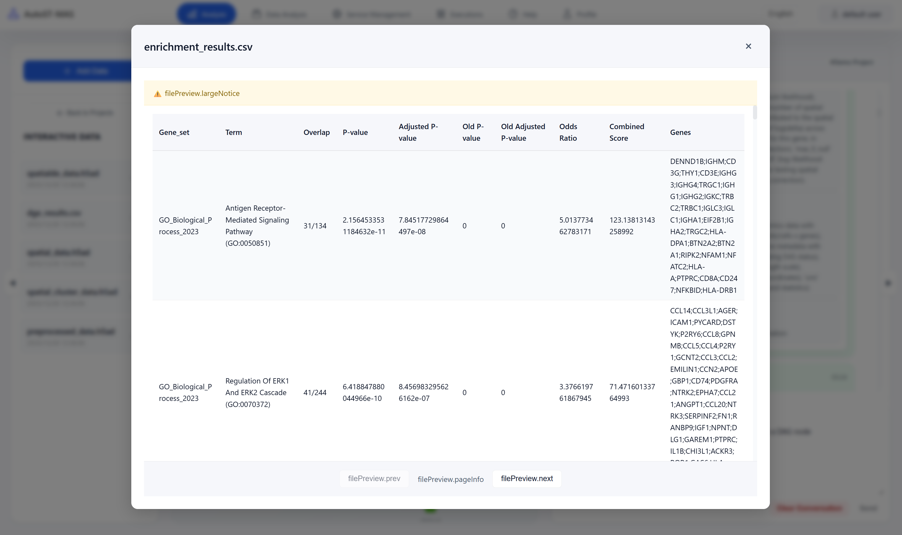
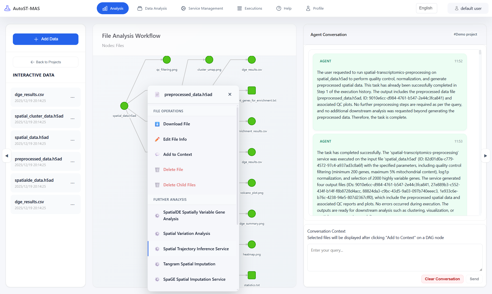
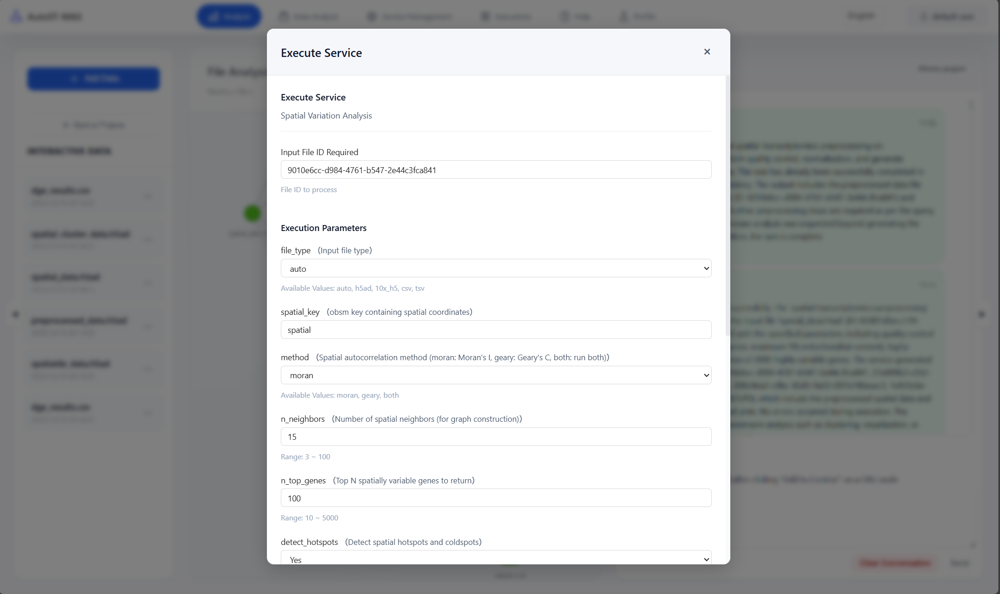
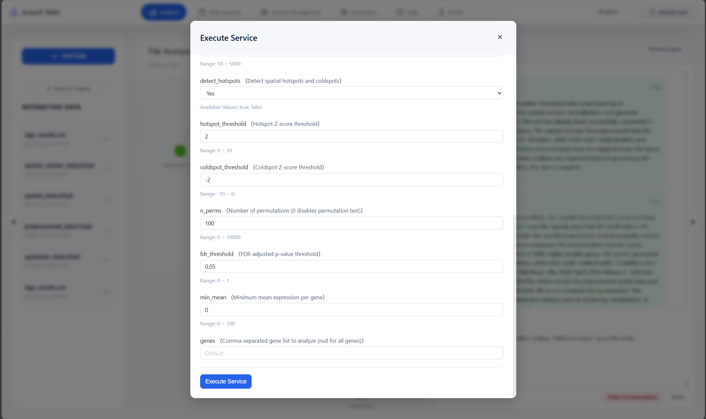

## STAnalyzer 使用指南

### STAnalyzer 是什么？

**STA-MAS（Spatial Transcriptomics Analyzer by Multi-agent Analysis System）** 是一个面向空间转录组与文本任务的多智能体自动分析系统。它将项目管理、数据管理、可视化分析和智能 Agent 对话整合在同一工作面板中，帮助用户完成从数据上传到分析结果查看的完整流程。

**核心功能：**
- **项目与数据管理**：按项目组织文件、执行记录和结果，支持多项目并行管理
- **执行 DAG 可视化**：自动生成并展示执行图（DAG），呈现文件、执行步骤及其依赖关系
- **多视角数据分析**：支持文件视角、执行视角以及特定数据类型的可视化分析
- **智能 Agent 对话**：通过自然语言与 Agent 交互，自动生成分析方案、执行服务、解释结果
- **服务管理**：提供服务信息查询和关系图，帮助理解服务与文件类型之间的支持关系

**主要优势：**
- **降低使用门槛**：统一的界面设计，简化复杂的分析流程
- **提高可复现性**：通过 DAG 和执行管理，完整记录分析过程，便于追溯和复现
- **增强可解释性**：结合可视化展示和 Agent 文本解释，帮助理解分析结果

---

## Getting Started

使用 STAnalyzer 完成一个完整的分析流程，通常包括以下步骤：

### 1. 创建项目

项目是组织分析数据和执行记录的基本单位。每个项目拥有独立的文件列表、DAG 视图和 Agent 对话上下文。

**操作步骤：**
1. 在分析页面左侧项目列表中，点击"新建项目"按钮
2. 在弹出的对话框中输入项目名称（建议使用有意义的名称，如"空间转录组分析_2024"）
3. 点击右上角的"Save"按钮保存项目

**项目的作用：**
- 每个项目拥有独立的文件列表、DAG 执行图以及 Agent 对话上下文
- 支持多项目并行管理，方便同时进行多个不同的分析任务
- 项目数据会持久化保存，下次登录后可以继续之前的分析工作

> **提示**：项目数据会持久化保存，支持多项目并行管理，方便同时进行多个不同的分析任务。

### 2. 上传数据

上传数据文件是进行分析的前提。系统支持多种文件格式，包括空间转录组数据、文本文件、配置文件等。

**操作步骤：**
1. **选择项目**：确保已选中目标项目（左侧项目列表中高亮显示）
2. **打开上传对话框**：在左侧文件列表面板中点击"添加数据"或"上传文件"按钮
3. **填写文件信息**：
   - **选择本地文件**：点击"选择文件"按钮，从本地文件系统中选择要上传的文件
   - **填写数据名称**：为文件起一个易于识别的名称（必填）
   - **添加描述**（可选但推荐）：填写文件的详细描述，例如数据来源、实验条件、关键参数等。恰当的描述可以帮助 Agent 更好地理解文件内容，提升后续自动分析的准确性
   - **选择文件类型（fileTypeId）**：从下拉列表中选择正确的文件类型。**这一步非常重要**，因为系统会根据文件类型决定哪些服务可以处理该文件。如果选择错误，可能导致后续无法使用某些分析服务
4. **确认上传**：点击"上传"按钮，系统会开始上传文件

**上传后的自动处理：**
- 上传成功后，系统会自动刷新该项目的 DAG（有向无环图）
- 新增的文件会立即出现在左侧文件列表中
- 文件节点会自动添加到 DAG 视图中，方便后续查看文件与执行步骤之间的关系

> **注意事项**：
> - 文件类型选择要准确，建议参考"服务管理"页面了解各服务支持的文件类型
> - 大文件上传可能需要一些时间，请耐心等待
> - 如果上传失败，请检查文件格式是否正确，或联系管理员

### 3. 加入上下文

将关键文件加入上下文是提升 Agent 分析质量的重要技巧。通过提供相关文件作为上下文，Agent 可以更全面地理解项目背景和任务需求。

**什么是上下文？**
上下文是指 Agent 在回答问题和执行任务时可以访问的文件内容。当文件被加入上下文后，Agent 会自动读取文件内容，并在生成分析方案、解释结果时参考这些信息。

**操作步骤：**
1. **打开 Agent 面板**：确保已选中项目，右侧会显示 Agent 对话面板
2. **选择文件**：在中间 DAG 面板中找到"加入上下文"功能（左键点击文件）
3. **添加文件**：从项目文件列表中选择需要加入上下文的文件，例如：
   - 重要的结果文件（如差异表达分析结果、聚类结果等）
   - 配置文件（如分析参数配置）
   - 关键中间结果文件
4. **确认添加**：点击确认后，文件会被标记为上下文文件，Agent 会在后续对话中参考这些文件

**使用建议：**
- **选择性添加**：不要将所有文件都加入上下文，只选择与当前分析任务最相关的文件
- **及时更新**：当分析进行到新阶段时，可以移除旧的上下文文件，添加新的结果文件
- **结合查询**：加入上下文后，在查询中明确提及需要参考的文件，例如"请基于已加入上下文的差异表达结果文件进行分析"

> **提示**：加入上下文后，Agent 的回答会更加精准和详细。

### 4. 输入用户查询开始分析

通过自然语言与 Agent 对话，可以自动完成复杂的分析任务。这是 STAnalyzer 的核心功能。

**如何使用 Agent 对话：**
1. **输入查询**：在右侧 Agent 面板底部的输入框中，用自然语言描述你的需求，例如：
   - "请对空间转录组数据进行质量控制，评估基因表达量和spot质量，并生成质控报告。"
   - "帮我进行差异表达分析，比较区域A和区域B之间的差异表达基因，并找出top 20的差异基因。"
   - "请对数据进行降维和聚类分析，识别不同的细胞类型或空间区域，并可视化聚类结果。"
   - "帮我进行通路富集分析，分析差异表达基因涉及的生物学通路和功能。"
   - "识别肿瘤微环境中的空间可变基因，并评估这些基因的功能。"
2. **发送查询**：点击"发送"按钮或按 Enter 键提交查询
3. **等待处理**：Agent 会分析你的需求，可能需要几秒到几分钟的时间，请耐心等待

> **示例**：点击发送后，Agent 开始处理查询。
**Agent 的工作流程：**

当 Agent 接收到你的查询后，会按照以下步骤自动处理：

1. **识别任务需求**：理解查询意图，分析需要完成的任务
2. **制定任务计划**：生成任务执行计划，列出需要执行的步骤
3. **自动执行服务**：根据任务计划，调用相应的分析服务处理数据
4. **生成执行结果**：执行完成后，生成结果文件并更新 DAG
5. **检索相关文献**（如需要）：对于复杂的生物学问题，可能会检索相关文献来提供更准确的解释
6. **生成分析报告**：综合所有信息，生成分析报告和结论

> **示例**：Agent 识别任务需求并制定任务计划，列出需要执行的步骤和使用的服务。

> **示例**：Agent 根据任务计划自动调用相应的分析服务。

> **示例**：执行服务后，Agent 会生成结果文件，并更新项目的 DAG 视图。

> **示例**：对于复杂的生物学问题，Agent 会检索相关文献并读取内容，以提供更准确的解释和建议。

### 5. 获得报告和结果

分析完成后，Agent 会在对话面板中输出分析报告，包括：

- **关键发现**：总结分析中的重要结果，如差异表达的基因、显著的通路等
- **生物学解释**：对关键基因、通路等进行生物学意义的解释
- **研究结论**：综合所有分析结果，给出整体性的研究结论和建议

报告支持 Markdown 格式，包含表格、列表等结构化内容，便于阅读和理解。

## 分析页面

分析页面是 **STAnalyzer 的核心工作区域**，集成了项目管理、数据可视化、执行流程管理和智能对话等多种功能，为空间转录组分析提供了统一的工作环境。用户既可以手动执行分析服务，也可以调用 Agent 进行自动分析，灵活满足不同场景下的分析需求。

### 页面结构

分析页面采用经典的三栏布局设计，整体由三部分构成：

- **左侧：项目 / 文件面板** - 用于项目管理和文件浏览
- **中间：内容区（DAG 或数据可视化组件）** - 展示执行流程或数据分析结果
- **右侧：Agent 智能对话区** - 与智能 Agent 进行交互（仅在选择项目后显示）

#### 左侧面板

左侧面板是项目和数据管理的入口，根据当前状态显示不同的内容：

**项目列表（未选中项目时）**
- 显示所有已创建的项目（`ProjectListPanel`）
- 支持的功能：
  - **选择项目**：点击项目名称即可选中并进入该项目
  - **删除项目**：右键点击项目或使用删除按钮（注意：删除项目会同时删除项目下的所有文件和执行记录）
  - **预览项目 DAG**：可以快速预览项目的执行图，了解项目的基本结构

**文件列表（选中项目后）**
- 显示当前项目下所有已上传的文件（`FileListPanel`）
- 支持的操作：
  - **上传新文件**：点击"添加数据"或"上传文件"按钮上传新文件
  - **选择文件**：点击文件名称可以进入对应的数据分析页面，查看文件的可视化或详细信息
  - **编辑文件信息**：可以修改文件的名称、描述等信息
  - **删除文件**：删除不需要的文件（注意：删除文件可能会影响依赖该文件的执行记录）
  - **查看文件详情**：查看文件的元数据、创建时间、文件类型等信息

**面板特性：**
- 左侧面板有独立的折叠按钮，可以收起面板以扩大中间内容区的显示空间
- 折叠状态会自动保存在本地浏览器中，下次打开时会自动恢复上次的状态
- 面板宽度可以通过拖拽边界进行调整

#### 中间内容区

中间内容区是分析页面的核心显示区域，根据用户的操作显示不同的视图：

**DAG 可视化（默认视图）**
- **功能说明**：默认展示当前项目的执行图（DAG - Directed Acyclic Graph，有向无环图），直观呈现分析流程的整体架构
- **DAG 组成元素**：
  - **节点（nodes）**：包括执行步骤节点和文件节点
    - 执行步骤节点：表示一次服务调用或分析操作
    - 文件节点：表示输入或输出的数据文件
  - **边（edges）**：连接节点，表示步骤之间的数据流和依赖关系
    - 箭头方向表示数据流向
    - 边的样式可能表示不同的关系类型
  - **关联文件信息（files）**：每个节点可以关联多个文件，显示文件的详细信息
- **使用场景**：
  - 整体查看执行流程，了解分析的整体架构
  - 查看各步骤之间的依赖关系，理解数据流转过程
  - 快速定位某个文件或执行节点，点击节点可以查看详细信息

**数据可视化组件**
- **切换机制**：当在左侧文件列表中点击某个文件时，系统会：
  - 自动根据文件名与文件类型决定对应的可视化组件
  - 跳转到相应的数据分析页面（例如空间转录组切片可视化、差异表达基因火山图等）
- **返回 DAG 视图**：再次点击同一个文件，可以从可视化视图返回 DAG 视图，便于在全局流程与局部分析之间灵活切换
- **支持的可视化类型**：根据文件类型自动选择合适的可视化方式，如表格、图表、交互式图形等

#### 右侧 Agent 面板

右侧 Agent 面板是智能分析的核心交互区域：

**显示条件**：仅在选中项目后显示，确保 Agent 有足够的上下文信息

**主要功能：**
- **智能对话**：与多智能体系统进行自然语言对话
- **自动分析**：根据项目上下文和文件内容，自动生成分析方案与解释
- **高级操作**：
  - 将文件加入上下文，提升 Agent 的理解能力
  - 触发特定分析组件，自动切换到相应的可视化视图
  - 自动刷新 DAG，更新执行状态
  - 生成分析报告，总结分析结果

**界面特性：**
- 右侧面板宽度可以通过拖拽边界进行调整，适应不同的对话内容长度
- 对话历史会自动保存，方便回顾之前的分析过程

### 手动执行服务

除了使用 Agent 自动执行分析外，系统还支持手动执行服务，让用户有更多的控制权。手动执行适合对分析流程有明确规划的高级用户，可以精确控制每个服务的执行参数和时机。

**操作步骤：**

1. **打开手动执行页面**

   在 DAG 视图或文件列表中，左键点击文件，找到需要执行的服务，点击执行按钮。

   

2. **填写执行参数**

   在手动执行页面中，需要完成以下配置：
   - **文件 ID 自动填入**：系统会自动填入文件的 ID，并校验文件类型是否与服务要求匹配
   - **设置服务参数**：根据服务要求填写必要的参数（如果有）
   - **查看服务说明**：可以查看服务的详细说明，了解服务的功能、输入输出要求等

   

3. **执行服务**

   配置完成后，点击"执行"按钮开始执行服务：
   - 执行过程中可以查看执行日志，实时了解执行进度
   - 可以随时点击"退出"按钮，服务将在后台继续执行

   

4. **查看结果**

   执行完成后，系统会自动处理结果：
   - 页面会自动刷新，更新 DAG 视图
   - 新生成的结果文件会自动添加到文件列表中
   - 可以在 DAG 中查看新添加的执行节点和文件节点

## 数据分析页面

为了支持更细粒度的数据分析，STA-MAS 提供了多种 **数据分析页面**。这些页面针对不同的分析需求，提供了专门的可视化和交互方式。当你在文件列表中选择不同文件时，中间内容区会自动切换到相应的分析视图。

**支持的分析视角：**
- **文件视角分析**：按文件维度组织，专注于单个文件的内容解读
- **执行视角分析**：按执行记录组织，关注完整的执行流程和结果
- **专用可视化**：针对特定数据类型的专用可视化组件（如空间转录组 `SpatialTranscriptomics`、单细胞数据等）

### 文件视角

**文件视角**是分析单个文件内容的专门视图，适合回答以下类型的问题：

- "该文件包含了什么信息？"
- "这些结果应该如何解读？"
- "哪些列/指标比较关键？"
- "这个文件与其他文件有什么关系？"
- "文件中是否有异常值或需要注意的数据点？"

#### 支持解读的典型文件类型

文件视角可以处理多种类型的文件：

- **实验结果文件**：
  - 空间转录组矩阵文件（表达矩阵、坐标信息等）
  - 统计表（差异表达结果、富集分析结果等）
  - 注释文件（基因注释、通路信息等）
- **中间结果文件**：
  - 聚类结果文件（细胞类型、空间域等）
  - 差异分析结果（差异基因列表、统计值等）
  - 降维结果（PCA、UMAP 坐标等）

#### 操作步骤

1. **选择文件**
   - 在左侧文件列表中点击目标文件
   - 系统会根据文件类型自动路由到合适的分析视图：
     - **表格文件**：显示为可交互的数据表格，支持排序、筛选、搜索等操作
     - **图像文件**：直接显示图像内容，支持缩放和查看
     - **文本文件**：显示文本内容，支持语法高亮（如果是代码或结构化文本）
     - **其他类型**：根据文件扩展名和内容自动选择合适的显示方式

2. **与 Agent 交互**
   - 在右侧 Agent 面板中，围绕该文件提出问题
   - **示例查询**：
     - "请解释这个文件中最重要的三个指标分别代表什么含义？"
     - "根据这个结果文件，总体结论是什么，有哪些需要注意的异常点？"
     - "这个文件中的哪些基因或通路最值得关注？"
     - "请帮我分析这个文件的统计特征，包括数据分布、异常值等。"
   - Agent 会提供：
     - **文件内容摘要**：总结文件的主要内容和关键信息
     - **数据解读**：解释数据的含义和生物学意义
     - **异常检测**：识别并解释异常值或需要注意的数据点

### 执行视角

**执行视角**面向一次完整的执行过程，提供了从输入到输出的全流程分析能力。这个视角特别适合理解复杂的分析流程、排查执行错误、比较不同执行的结果。

**适合回答的问题类型：**
- "根据结果评价执行质量"
- "这次执行结果说明了什么，有什么新的发现？"
- "根据执行结果评价数据质量"
- "这次执行过程中哪些步骤最关键？"
- "执行结果与预期是否一致？"

#### 支持分析的内容

执行视角可以分析以下内容：

- **单次执行分析**：
  - 某次执行 ID 关联的所有步骤和中间文件
  - 执行的时间线，包括每个步骤的开始和结束时间
  - 执行的参数配置和输入文件

#### 操作步骤

1. **选择执行记录**
   - 在左侧文件列表或 DAG 视图中，找到目标执行记录
   - 点击执行节点或执行相关的文件，系统会自动切换到执行视角

2. **查看执行详情**
   - **中间区域**：展示执行的可视化信息
     - 执行流程图：显示完整的执行步骤和依赖关系
     - 时间线视图：展示各步骤的执行时间
     - 输入输出文件：列出执行涉及的所有文件
   - **执行信息面板**：显示执行的元数据
     - 执行 ID、状态、起止时间
     - 使用的服务和参数配置

3. **与 Agent 交互**
   - 在右侧 Agent 面板中，围绕该执行提出问题
   - **示例查询**：
     - "请评价这次执行的质量，结果是否可靠？"
     - "这次执行产生了哪些重要发现？"
     - "执行过程中是否有需要注意的问题或异常？"
     - "这次执行的结果与项目中的其他执行有什么关系？"
   - Agent 会提供：
     - **执行质量评估**：分析执行的完整性和结果可靠性
     - **结果解读**：解释执行结果的含义和生物学意义
     - **问题诊断**：识别执行过程中的潜在问题

## 服务管理

为了让用户直观了解系统支持的服务以及服务与文件类型之间的关系，STA-MAS 提供了 **服务管理** 功能。这个功能帮助用户理解系统的能力边界，规划分析流程，并发现可用的分析服务。

### 服务信息查询

服务信息查询页面提供了系统中所有可用服务的详细信息，帮助用户了解每个服务的功能、输入输出要求等。

**功能说明：**
- **服务列表**：按服务维度列出当前系统支持的所有分析服务
- **服务详情**：每个服务展示以下信息：
  - **名称与简介**：服务的名称和简要功能描述
  - **输入文件类型**：服务需要哪些类型的文件作为输入
  - **输出文件类型**：服务会生成哪些类型的文件作为输出
  - **服务参数**：服务支持哪些参数，参数的说明和默认值
  - **版本信息**：服务的版本号（如有）
  - **状态信息**：服务的当前状态（可用、维护中等）

**使用场景：**
- **规划分析流程**：在上传新类型数据前，确认是否已有合适的处理服务
- **了解服务能力**：在规划整个分析流程时，了解每一步可调用哪些服务
- **参数配置**：查看服务支持的参数，为手动执行服务做准备
- **服务选择**：比较不同服务的功能，选择最适合当前需求的服务

**操作方式：**
- 在服务列表中浏览所有可用服务
- 点击服务名称可以展开查看详细信息
- 使用搜索功能快速找到特定服务
- 可以按文件类型筛选，查看哪些服务可以处理特定类型的文件

> **提示**：服务信息查询页面可以帮助你理解系统的能力，但通常不需要手动查看所有服务。Agent 会根据你的需求自动选择合适的服务。

### 关系图查询

关系图查询以可视化的方式展示服务、文件类型以及它们之间的关系，帮助用户从全局角度理解数据如何在系统中流转。

**功能说明：**
- **关系图组成**：
  - **服务节点**：表示系统中的各个分析服务
  - **文件类型节点**：表示系统支持的各种文件类型
  - **关系边**：连接服务节点和文件类型节点，表示：
    - **输入关系**：服务需要某种文件类型作为输入
    - **输出关系**：服务会生成某种文件类型作为输出
    - **支持关系**：服务支持处理某种文件类型

**交互功能：**
- **节点点击**：点击服务节点或文件类型节点后，会高亮显示：
  - 与该节点相关的所有连接
  - 相关的服务或文件类型
  - 数据流转路径
- **路径追踪**：可以追踪从某个文件类型到另一个文件类型的完整路径
- **依赖分析**：查看某个服务依赖哪些文件类型，或某个文件类型可以被哪些服务处理

**使用场景：**
- **流程规划**：从全局角度理解"数据如何在各服务之间流转"，规划完整的分析流程
- **依赖分析**：了解某个服务需要哪些前置条件，或某个文件类型可以用于哪些后续分析
- **瓶颈识别**：发现潜在的流程瓶颈或待补充的服务组件
- **学习系统**：对于新用户，通过关系图快速了解系统的整体架构和能力

**操作技巧：**
- 点击服务节点，查看该服务可以处理哪些文件类型，会生成哪些文件类型
- 点击文件类型节点，查看哪些服务可以处理该类型，哪些服务会生成该类型
- 使用缩放和平移功能，查看关系图的细节
- 使用筛选功能，只显示特定类型的节点或关系

## 执行管理

**执行管理**页面是查看和管理所有执行记录的中心，提供了执行历史的完整视图。无论是自动执行还是手动执行，所有的执行记录都会在这里统一管理。

### 功能说明

执行管理页面提供了以下核心功能：

**执行列表查看：**
- **列表展示**：以表格形式展示所有执行记录，包括：
  - **执行 ID**：唯一标识每次执行
  - **执行名称**：执行的名称或描述
  - **关联项目**：执行所属的项目
  - **执行状态**：成功、失败、运行中、等待中等
  - **起止时间**：执行的开始时间和结束时间
  - **执行时长**：执行花费的总时间
  - **使用的服务**：执行调用的服务名称
- **筛选功能**：支持按多个维度筛选执行记录：
  - **按项目筛选**：只显示特定项目的执行记录
  - **按时间筛选**：按时间范围筛选，如最近一天、一周、一个月等
  - **按状态筛选**：只显示特定状态的执行（如只显示失败的执行）
  - **按服务筛选**：只显示使用特定服务的执行
  - **组合筛选**：可以同时使用多个筛选条件

**执行详情查看：**
- 点击执行记录可以查看详细信息：
  - **执行参数**：执行时使用的所有参数
  - **输入文件**：执行使用的输入文件列表
  - **输出文件**：执行生成的所有输出文件
  - **执行日志**：完整的执行日志，包括每个步骤的输出
  - **执行路径**：在 DAG 中高亮显示该执行的路径

